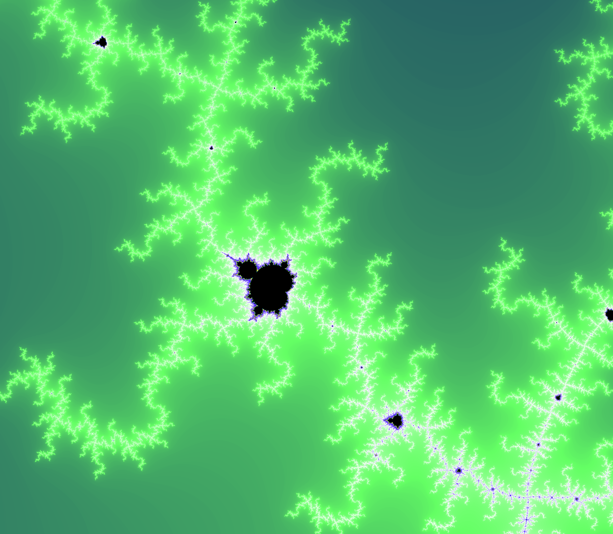

# Evaluation of Gurobi solver

1. Results for **Gurobi version 12.0.3** are listed in [here](./evaluation/v12.0.3/README.md).

## [Gurobi](https://www.gurobi.com)

Gurobi is a commercial mathematical optimization solver that uses advanced algorithms to find optimal solutions to linear programming, mixed-integer programming, quadratic programming, and other optimization problems commonly found in operations research, logistics, finance, and engineering applications.

## [Open Energy Benchmark](https://openenergybenchmark.org/)

The Open Energy Benchmark is an open-source benchmark of optimization solvers on representative problems from the energy planning domain built to provide data and insights for participants in the green energy transition including solver developers, energy modelers, and stakeholders.

## [NEOS Server](https://neos-server.org/neos/)

NEOS Server is a free internet-based service that provides access to more than 60 state-of-the-art solvers across various optimization categories, hosted by the Wisconsin Institute for Discovery and running on distributed high-performance machines. 

## [Fractal image](https://jsdw.me/js-fractal-explorer/)

The fractal image was created using the JavaScript Fractal Explorer program, which was written by James Wilson.

